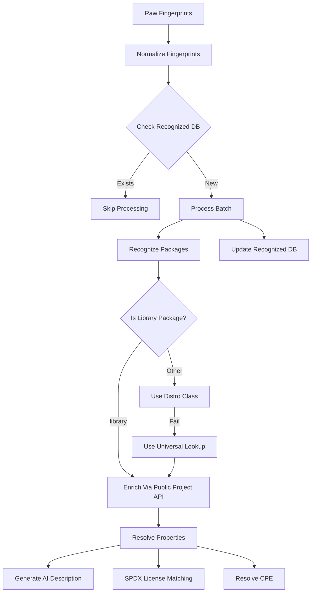

# Linux Recognition


## Project Overview
Linux Recognition is an asynchronous backend service that identifies Linux source packages from software fingerprints. The system normalizes input fingerprints and employs distro-specific logic to resolve package origins. It fetches detailed metadata (source package name, description, licenses, homepage) and enriches it using public repository APIs, obtaining additional information (author/publisher, release date, CPE string).




## Features

### Fingerprint Processing
- **Input**: List of dictionaries with software, publisher, and version fields (e.g., from SCCM inventory)
- **Normalization**: Standardizes software names and versions

### Distro-Specific Package Recognition

- **Supported Distros**: Debian, Ubuntu, Fedora, OpenSUSE, Arch, Alpine and others
- **Two-Stage Lookup**:
  - UniversalPackage: Uses Repology database dump
  - Fallback to Native APIs (e.g., Debian/Ubuntu → Ultimate Debian Database).

### Metadata Enrichment
- **Supported Repos**: GitHub, GitLab, Pagure, MetaCPAN, SourceForge, PyPI, RubyGems
- **Process**:
  - Updates initial metadata (description, license) from repo APIs
  - Extracts release dates by matching version to tags/releases using custom heuristics
  - Parses unstructured date formats using generalized date parser

### AI-Powered Features
- **Package description**: Uses OpenAI to generate 2-sentence formal description from raw text

- **SPDX License Normalization**:
  - Creates Faiss embeddings of SPDX license database:
  - Matches licenses via:
    - Exact database lookup
    - Similarity search (threshold-based)
    - Fallback to original license + DB update

### Miscellaneous
- **JSON Logging**: extensive structured JSON logs for detailed traceability and analysis
- **Configuration Validation**: Pydantic models for robust configuration


## Strengths
- **Provenance Resolution**: Accurately traces packages across multiple Linux distros despite naming inconsistencies
- **License Compliance**: Automates SPDX license matching using AI similarity thresholds
- Handles real-world data variance through:
  - Flexible version matching 
  - Robust date parsing 
  - Multi-source metadata reconciliation
  

## Tech Stack
  - Fully asynchronous workflow (aiohttp + asyncpg)
  - PostgreSQL storage
  - FAISS + Langchain
  - pytest (test coverage)


## Prerequisites
- Python 3.13+ 
- PostgreSQL 17+
- Repology database dump (https://dumps.repology.org/)


## Installation & Setup

```bash
# 1. Install from source (recommended)
git clone https://github.com/auxacc1/linux-recognition
cd linux-recognition
pip install .  # Installs package and dependencies from pyproject.toml

# 2. Initialize project (one-time setup)
linux_recognition_initialize  # creation + rebuild of databases and data download
```


## Usage

```python
import asyncio

from linux_recognition.recognition import recognize


raw_fingerprints = [
    {
    'software': 'yast2-ycp-ui-bindings',
    'publisher': 'SUSE LLC <https://www.suse.com/>',
    'version': '4.3.9'
    },
    {
    'software': 'nodejs010-nodejs-osenv',
    'publisher': 'Red Hat, Inc.',
    'version': '0.1.3-1.el7'
    },
]


asyncio.run(recognize(raw_fingerprints))
```


## Configuration
Use [config](linux_recognition/config/config.yaml) file to customize database connections, logging behavior, and AI model selection.

### Required Credentials  
Set these as environment variables with the prefix `LINUX_RECOGNITION__` (e.g., `LINUX_RECOGNITION__OPENAI_API_KEY`):  


| Variable                               | Second Header                                        |
|----------------------------------------|------------------------------------------------------|
| `DATABASE__POSTGRES_DEFAULT__PASSWORD` | Password for local PostgreSQL databases              |
| `PYPI_USER_AGENT`                      | (Non-secret) User-agent string for PyPI API requests |
| `SOURCEFORGE_BEARER`                   | Bearer token for SourceForge API access              |
| `OBS_USERNAME` & `OBS_PASSWORD`        | Credentials for Open Build Service (OBS)             |
| `GITHUB_TOKEN`                         | GitHub Personal Access Token for API access          |
| `OPENAI_API_KEY`                       | API key for OpenAI services                          |


## License
[MIT License](LICENSE)


## More info soon
